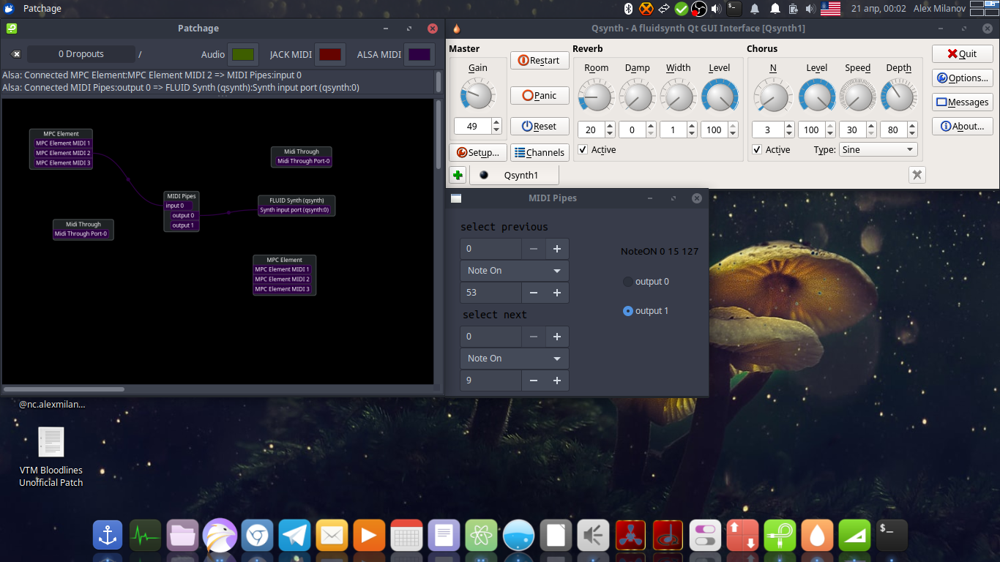

# midi-pipes
App that allows you to create midi pipelines where midi message from
a control device routes where midi messages will be diverted. For example if you
have a midi keyboard and you want to be able to switch between different
hardware or app synths that this keyboard/controller should control.



## build
```sh
./build.sh
```

## run
```sh
./build/midi_pipes
```
